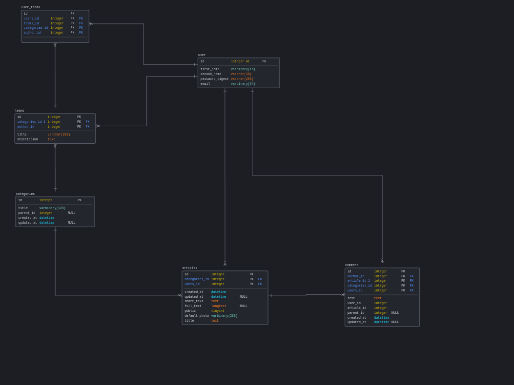

# Version

- ruby 3.0.0
- rails 7.0.1
- bundle 2.1.4
- gem 3.1.2

# System dependencies

- Linux(Ubuntu 20.04.3 LTS)

# Configuration

- Config your database.yml for postgres

# Database

After config database.yml run:

```bash
rails db:create
rails db:migrate
rails db:seed
```

If you have error with db try delete regenerate master.key and credentials.yml.enc

For create db diagrams use [DbSchema](https://dbschema.com/download.html)

For each migration(table) need create a seed



# For install ruby

- install [rbenv](https://github.com/rbenv/rbenv)

```bash
\curl -sSL https://get.rvm.io | bash -s stable --ruby
rbenv init
echo 'export PATH="$HOME/.rbenv/bin:$PATH"' >> ~/.bashrc
```

- install current version and run:

```bash
bundle install
npm i  
```

- run server

```bash
rails s -p 3001
```

- for build scss use

```bash
npm run-script build:css
```

# I18n

For crete translate are using service [lokalise](https://app.lokalise.com/)
You need add integration with gem ``lokalise_rails`` and create own .env file

After integration api and project id, run command:

```bash
rails lokalise_rails:export
```

After done Translation, use:
```bash
rails lokalise_rails:import
```
or download file from service

# Authors

- [Kefirchick](mailto:zacharpu2@gmail.com?subject=[GitHub]%20Source%20Han%20Sans)


